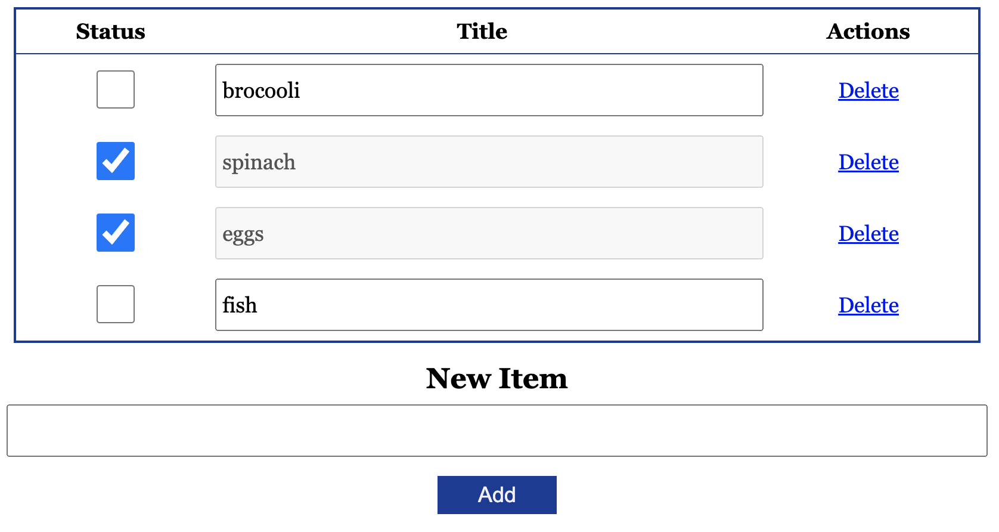

# TodoHTMX

A basic "To-do" app written in the HTMX pattern.



# What?

This is a simple "To-do" type of app written using the HTMX library. I wanted to just see what the library was about and tried my best to not use JS on the client side aside from the HTMX library itself.

The goal was to evaluate the library and understand **hypermedia** driven experiences.

# How to Install

You will just need `node@^20` and just execute the `start` script.

For example:

```
yarn start
```

`nodemon` is used as the engine to restart whenever the node process could possibly terminate.

The default port is `6777` but you can override it with `process.env.PORT`.

So for example:

```sh
export PORT=3000
yarn start
```

# How to Use

The UI is pretty intuitive. Simply add a list item with the form below. It will be added to the list, and you can edit the existing item by just typing in the input field, and you can "check off" an item as "done". If you feel like the list item should no longer be shown, then simply delete by pressing the **Delete** link.

# So how is it?

It's really hard to say right now. I would say I spent a lot more time thinking about proper patterns in implementing a hypermedia driven approach to app development. I think development could have gone much faster if I stuck to my usual approaches in using plain JavaScript.

However this is all for education, and I do see the value of HTMX in that it does simplify the front end part of the stack a bit more to avoid any toolchain to transpile/bundle to any JS.

Vanilla JavaScript as of 2024 is getting way better though, and I am convinced that the VanillaJS + HTML5 + CSS stack is much more intuitive. Under some cases, HTMX might be a good supplement.
